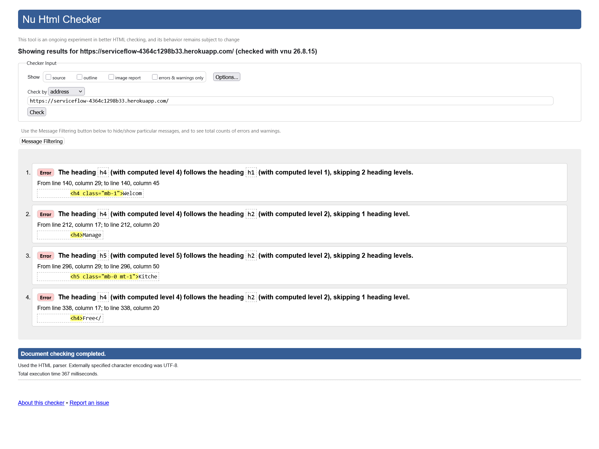
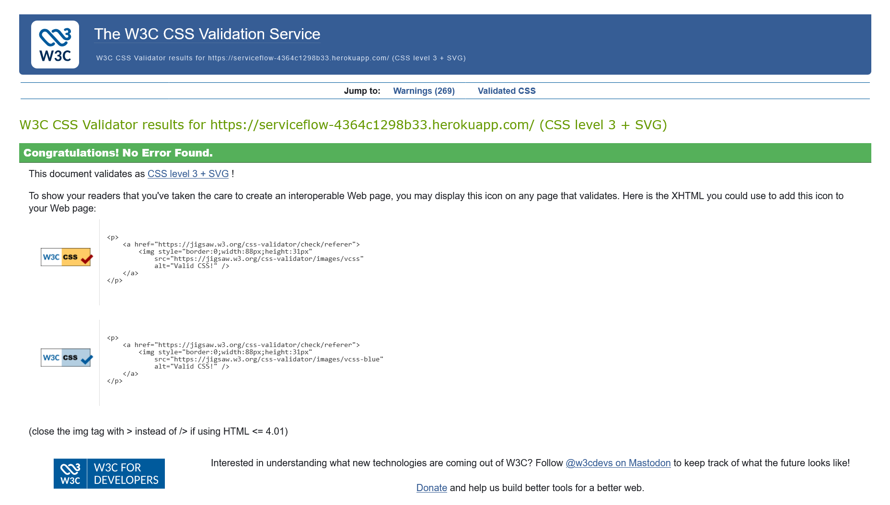
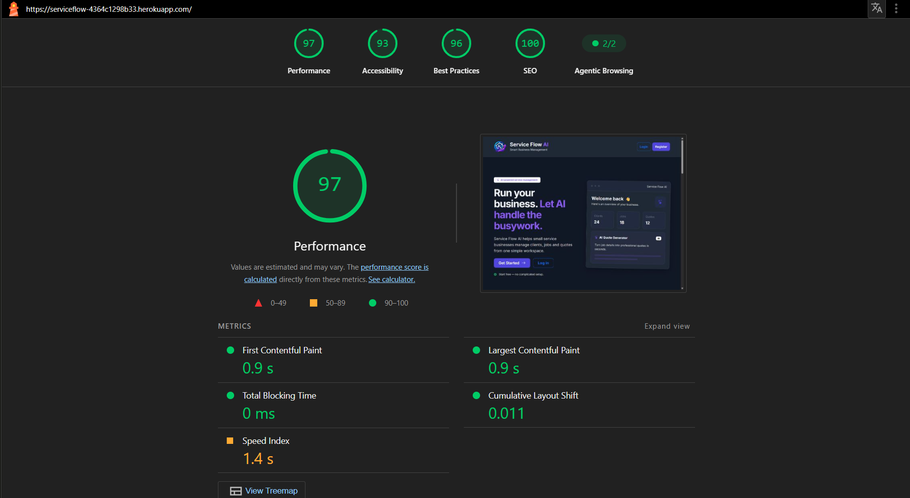

# Validations and Tests

## HTML and CSS Validation

## Lighthouse

## JavaScript Validation

The JavaScript code that has been used for this project is very minimal and does not need any special validation. The code is simple and does not have any complex logic that would require validation. However, if you want to validate the JavaScript code, you can use the [JSHint](https://jshint.com/) tool.